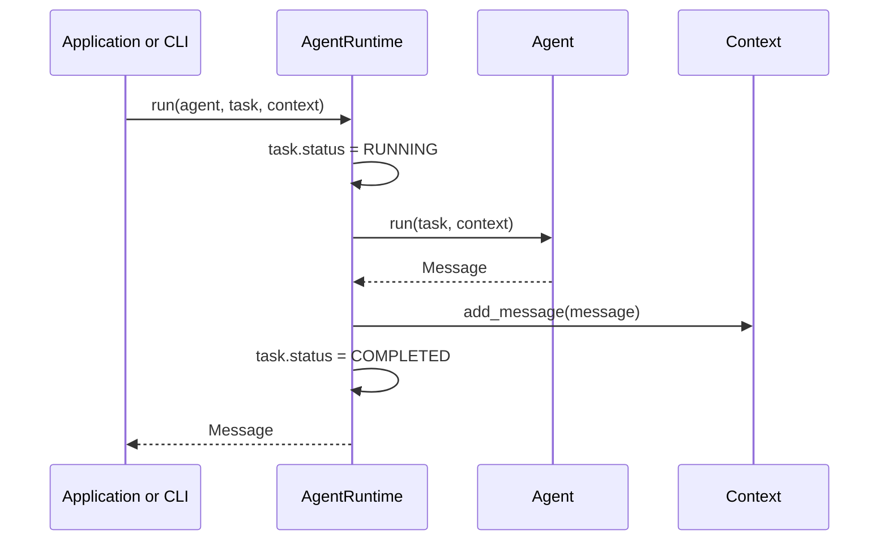
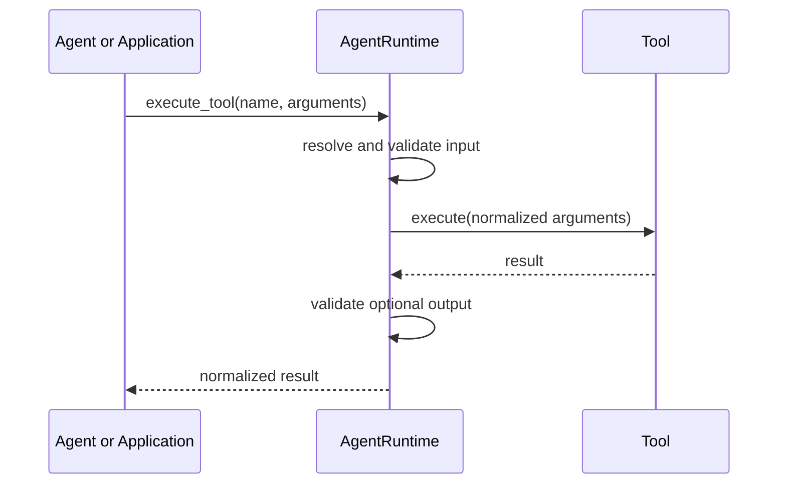

# Architecture

Numa v0.1.0 establishes small interfaces and a synchronous execution path. It deliberately avoids model providers, planners, distributed queues, and multi-agent protocols until their requirements are proven by real integrations.

## Design Decisions

1. **Use a `src` layout.** Imports resolve from the installed package instead of accidentally resolving from the repository root.
2. **Separate data from behavior.** `Task`, `Message`, and `Context` are framework-neutral models. `Agent`, `Tool`, and `Memory` define behavioral boundaries.
3. **Keep orchestration thin.** `AgentRuntime` controls task lifecycle and dependency access, but does not implement agent strategy.
4. **Depend on abstractions.** Runtime and application code can replace memory and tool adapters without changing agents.
5. **Start synchronously.** A clear synchronous contract is easier to test. Async execution can be introduced as a parallel runtime contract when needed.
6. **Use focused dependencies.** Logging and CLI behavior build on `logging` and `argparse`; PyYAML handles configuration files and Pydantic defines tool boundaries.

## Repository Tree

```text
numa/
├── .github/
│   ├── ISSUE_TEMPLATE/
│   │   ├── bug_report.yml
│   │   └── feature_request.yml
│   ├── workflows/
│   │   └── ci.yml
│   └── PULL_REQUEST_TEMPLATE.md
├── docs/
│   ├── architecture.md
│   ├── design.md
│   ├── plugins.md
│   ├── quick-start.md
│   └── vision.md
├── examples/
│   ├── basic_agent.py
│   ├── basic_tool.py
│   └── sqlite_memory.py
├── src/
│   └── numa/
│       ├── agents/
│       │   ├── base.py
│       │   └── echo.py
│       ├── config/
│       │   └── settings.py
│       ├── core/
│       │   ├── exceptions.py
│       │   └── models.py
│       ├── memory/
│       │   ├── base.py
│       │   ├── in_memory.py
│       │   └── sqlite.py
│       ├── plugins/
│       │   ├── discovery.py
│       │   └── exceptions.py
│       ├── runtime/
│       │   └── runtime.py
│       ├── tools/
│       │   ├── arithmetic.py
│       │   └── base.py
│       ├── utils/
│       │   └── logging.py
│       ├── cli.py
│       └── py.typed
├── tests/
│   └── unit/
├── CONTRIBUTING.md
├── LICENSE
├── pyproject.toml
├── README.md
└── ROADMAP.md
```

## Module Responsibilities

### `core`

Contains stable data contracts and the exception hierarchy. It has no provider, storage, or application policy.

- `Task` tracks a unit of work and its lifecycle.
- `Message` carries typed conversation output and metadata.
- `Context` owns ordered messages and execution-scoped metadata.
- `NumaError` gives callers one framework-level exception boundary.

### `agents`

Defines the `Agent` abstraction. An agent owns task-specific behavior and returns one `Message`. `EchoAgent` is a deterministic example, not an AI implementation.

### `runtime`

Coordinates agent and tool invocations. It changes task state, records agent results, validates registered tool boundaries, logs lifecycle events, and converts implementation failures into framework exceptions.

### `tools`

Defines named executable capabilities. Each tool exposes a Pydantic input model, an optional output model, and generated JSON Schemas. `AgentRuntime.execute_tool()` validates and normalizes input before execution and validates declared output afterward.

`ToolInput` rejects undeclared arguments by default. Direct calls to `Tool.execute()` remain available for low-level use, but bypass runtime lookup, validation, logging, and exception conversion.

### `memory`

Defines minimal key-value memory operations. `InMemoryMemory` supports ephemeral execution and tests. `SQLiteMemory` persists JSON-compatible values behind the same contract, converts storage and serialization failures into `MemoryError`, and serializes access to its connection for thread-safe use within a process.

The SQLite adapter owns one connection for its lifetime so `:memory:` databases and transaction behavior remain predictable. Applications should use its context manager or call `close()` when the runtime no longer needs it.

### `plugins`

Discovers Agent and Tool factories from the `numa.agents` and `numa.tools` Entry Point groups. Discovery records names without importing plugin code. A plugin is loaded only when requested, then its factory result and component name are validated against the registered contract.

Built-in components use the same lazy `Plugin` descriptor as third-party packages. Duplicate names fail discovery instead of silently replacing an implementation.

### `config`

Loads typed defaults, JSON or YAML files, then environment overrides. Configuration remains immutable after loading so execution behavior is predictable.

### `utils`

Contains narrow shared infrastructure. The logging helper configures only the `numa` namespace, preserving control for embedding applications.

### `cli`

Provides project initialization, plugin inspection, and an Agent runner backed by plugin discovery. It is an adapter over public APIs rather than a separate execution engine.

## Execution Flow



If an agent raises, the runtime marks the task failed, records the original error text, logs the exception, and raises `AgentExecutionError` with the original exception as its cause.

## Tool Execution Flow



Unknown names raise `ToolNotFoundError`, schema violations raise `ToolValidationError`, and implementation failures raise `ToolExecutionError`. Wrapped failures retain their original exception as `__cause__`.

## Extension Points

- **Model integration:** implement an `Agent` that depends on a provider-specific client owned by the application.
- **Persistent memory:** add specialized PostgreSQL, Redis, or vector retrieval contracts without expanding the minimal key-value interface prematurely.
- **Tool ecosystem:** implement `Tool` adapters and add permission, isolation, retry, and telemetry policy around registration.
- **Async runtime:** add an async agent contract and runtime without changing the synchronous API.
- **Planning:** compose tasks above `AgentRuntime`; do not embed planning policy into the base runtime.
- **Multi-agent collaboration:** add routing and message transport as a higher orchestration layer.
- **Observability:** attach structured, file, or telemetry handlers through the standard logging interface.
- **Plugins:** add compatibility metadata, version constraints, and optional plugin diagnostics without importing components during listing.

## Current Boundaries

The foundation does not include LLM calls, prompt templates, autonomous loops, persistent storage, networking, distributed execution, or multi-agent coordination. These omissions are intentional while v0.2 integration boundaries are developed incrementally.
