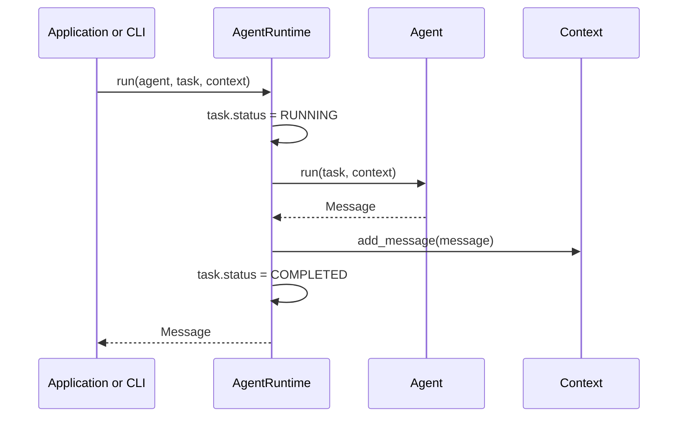
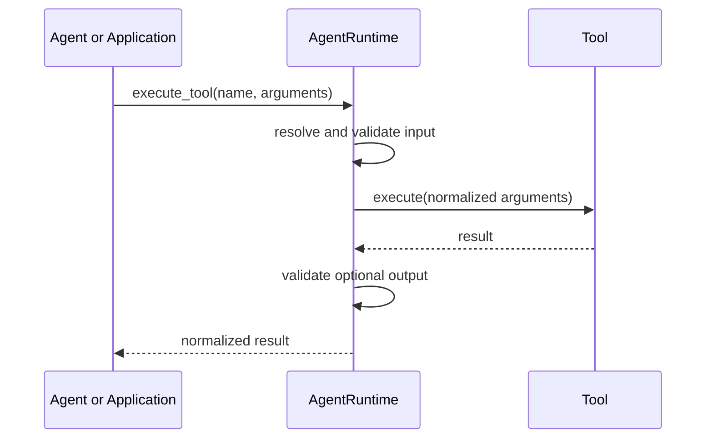

# Architecture

Numa establishes small interfaces, optional integration boundaries, and parallel synchronous and asynchronous execution paths. It deliberately avoids planning policy, distributed queues, and multi-agent protocols until their requirements are proven by real integrations.

## Design Decisions

1. **Use a `src` layout.** Imports resolve from the installed package instead of accidentally resolving from the repository root.
2. **Separate data from behavior.** `Task`, `Message`, and `Context` are framework-neutral models. `Agent`, `Tool`, and `Memory` define behavioral boundaries.
3. **Keep orchestration thin.** `AgentRuntime` controls task lifecycle and dependency access, but does not implement agent strategy.
4. **Depend on abstractions.** Runtime and application code can replace memory and tool adapters without changing agents.
5. **Keep sync and async explicit.** `AgentRuntime` and `AsyncAgentRuntime` accept their corresponding component contracts without implicit thread offloading or event-loop management.
6. **Make resilience policy explicit.** Async timeout and retry behavior is immutable, bounded, and opt-in; cancellation always remains visible to callers.
7. **Use focused dependencies.** Logging and CLI behavior build on `logging` and `argparse`; PyYAML handles configuration files and Pydantic defines tool boundaries.

## Repository Tree

```text
numa/
├── .github/
│   ├── ISSUE_TEMPLATE/
│   │   ├── bug_report.yml
│   │   └── feature_request.yml
│   ├── workflows/
│   │   └── ci.yml
│   └── PULL_REQUEST_TEMPLATE.md
├── docs/
│   ├── architecture.md
│   ├── design.md
│   ├── events.md
│   ├── model-providers.md
│   ├── plugins.md
│   ├── quick-start.md
│   ├── runtime-policies.md
│   └── vision.md
├── examples/
│   ├── async_runtime.py
│   ├── basic_agent.py
│   ├── basic_tool.py
│   ├── model_provider.py
│   ├── runtime_resilience.py
│   ├── structured_events.py
│   └── sqlite_memory.py
├── src/
│   └── numa/
│       ├── agents/
│       │   ├── async_base.py
│       │   ├── async_echo.py
│       │   ├── base.py
│       │   └── echo.py
│       ├── config/
│       │   └── settings.py
│       ├── core/
│       │   ├── exceptions.py
│       │   └── models.py
│       ├── events/
│       │   ├── bus.py
│       │   ├── handlers.py
│       │   └── models.py
│       ├── memory/
│       │   ├── base.py
│       │   ├── in_memory.py
│       │   └── sqlite.py
│       ├── plugins/
│       │   ├── discovery.py
│       │   └── exceptions.py
│       ├── providers/
│       │   ├── base.py
│       │   ├── echo.py
│       │   └── exceptions.py
│       ├── runtime/
│       │   ├── async_runtime.py
│       │   ├── policies.py
│       │   └── runtime.py
│       ├── tools/
│       │   ├── arithmetic.py
│       │   ├── async_arithmetic.py
│       │   ├── async_base.py
│       │   └── base.py
│       ├── utils/
│       │   └── logging.py
│       ├── cli.py
│       └── py.typed
├── tests/
│   └── unit/
├── CONTRIBUTING.md
├── LICENSE
├── pyproject.toml
├── README.md
└── ROADMAP.md
```

## Module Responsibilities

### `core`

Contains stable data contracts and the exception hierarchy. It has no provider, storage, or application policy.

- `Task` tracks a unit of work and its lifecycle.
- `Message` carries typed conversation output and metadata.
- `Context` owns ordered messages and execution-scoped metadata.
- `NumaError` gives callers one framework-level exception boundary.

### `agents`

Defines parallel `Agent` and `AsyncAgent` abstractions. An Agent owns task-specific behavior and returns one `Message`. Echo implementations are deterministic examples, not AI integrations.

### `events`

Defines structured Agent, Tool, and Provider lifecycle events, including explicit async cancellation transitions. `EventBus` dispatches synchronously to registered handlers and isolates handler failures from framework execution. Built-in producers emit correlation IDs, component names, UTC timestamps, transition types, and minimal metadata without including prompts, arguments, or results.

### `runtime`

Coordinates Agent and Tool invocations. `AgentRuntime` executes synchronous components; `AsyncAgentRuntime` awaits asynchronous components, can gather independent Agent runs concurrently, and applies immutable timeout and retry policies. Both change task state, record results, validate Tool boundaries, emit structured events, log lifecycle transitions, and convert implementation failures into framework exceptions.

Async policy timeouts cover all attempts and backoff delays. External cancellation is never retried or wrapped. Schema validation and Tool lookup remain outside the retry boundary.

### `tools`

Defines named synchronous and asynchronous capabilities. Each Tool exposes a Pydantic input model, an optional output model, and generated JSON Schemas. Runtime execution validates and normalizes input before execution and validates declared output afterward.

`ToolInput` rejects undeclared arguments by default. Direct calls to `Tool.execute()` remain available for low-level use, but bypass runtime lookup, validation, logging, and exception conversion.

### `memory`

Defines minimal key-value memory operations. `InMemoryMemory` supports ephemeral execution and tests. `SQLiteMemory` persists JSON-compatible values behind the same contract, converts storage and serialization failures into `MemoryError`, and serializes access to its connection for thread-safe use within a process.

The SQLite adapter owns one connection for its lifetime so `:memory:` databases and transaction behavior remain predictable. Applications should use its context manager or call `close()` when the runtime no longer needs it.

### `plugins`

Discovers Agent and Tool factories from the `numa.agents` and `numa.tools` Entry Point groups. Discovery records names without importing plugin code. A plugin is loaded only when requested, then its factory result and component name are validated against the registered contract.

Built-in components use the same lazy `Plugin` descriptor as third-party packages. Duplicate names fail discovery instead of silently replacing an implementation.

### `providers`

Defines the synchronous boundary between Agents and model vendor SDKs. `ModelRequest` carries messages, an optional model name, provider parameters, and application metadata. `ModelResponse` returns a framework `Message`, the resolved model, optional token usage, and provider metadata.

Provider adapters own SDK-specific serialization, authentication, and exception conversion. The core contract does not implement retries, streaming, tool loops, or model selection policy. `EchoModelProvider` is a deterministic adapter for examples and tests, not a model integration.

### `config`

Loads typed defaults, JSON or YAML files, then environment overrides. Configuration remains immutable after loading so execution behavior is predictable.

### `utils`

Contains narrow shared infrastructure. The logging helper configures only the `numa` namespace, preserving control for embedding applications.

### `cli`

Provides project initialization, plugin inspection, and an Agent runner backed by plugin discovery. It is an adapter over public APIs rather than a separate execution engine.

## Execution Flow



If an agent raises, the runtime marks the task failed, records the original error text, logs the exception, and raises `AgentExecutionError` with the original exception as its cause.

## Tool Execution Flow



Unknown names raise `ToolNotFoundError`, schema violations raise `ToolValidationError`, and implementation failures raise `ToolExecutionError`. Wrapped failures retain their original exception as `__cause__`.

## Extension Points

- **Model integration:** implement `ModelProvider` adapters in optional packages and inject them into application Agents.
- **Persistent memory:** add specialized PostgreSQL, Redis, or vector retrieval contracts without expanding the minimal key-value interface prematurely.
- **Tool ecosystem:** implement `Tool` adapters and add permission, isolation, retry, and telemetry policy around registration.
- **Runtime policies:** add middleware composition and specialized policies without changing synchronous APIs or hiding blocking work in the event loop.
- **Planning:** compose tasks above `AgentRuntime`; do not embed planning policy into the base runtime.
- **Multi-agent collaboration:** add routing and message transport as a higher orchestration layer.
- **Observability:** attach logging handlers or implement `EventHandler` adapters for metrics, tracing, audit, and OpenTelemetry backends.
- **Plugins:** add compatibility metadata, version constraints, and optional plugin diagnostics without importing components during listing.

## Current Boundaries

The foundation does not include vendor LLM adapters, prompt templates, autonomous loops, network services, distributed execution, or multi-agent coordination. Synchronous Runtime resilience and side-effect compensation are intentionally deferred.
